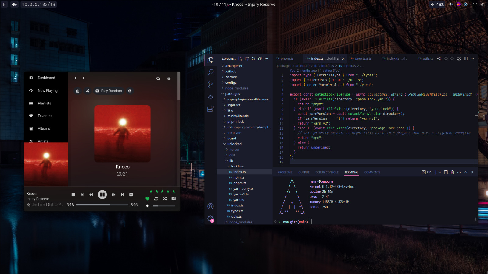

# Henry's Dotfiles

 

# setup

- **OS**: Arch Linux
- **WM**: [Hyprland](https://github.com/hyprwm/hyprland)
- **Bar**: [Waybar](https://github.com/Alexays/Waybar)
- **Terminal**: [Kitty](https://sw.kovidgoyal.net/kitty/)
- **Kernel**: [linux-tkg](https://github.com/Frogging-Family/linux-tkg) w/ bmq scheduler
- **Shell**: [Zsh](https://www.zsh.org/)
- **Editor**: [VSCode](https://code.visualstudio.com/) w/ my [1am](https://github.com/explodingcamera/1am-vscode) theme
- **Dotfiles Manager**: [YADM](https://yadm.io/)
